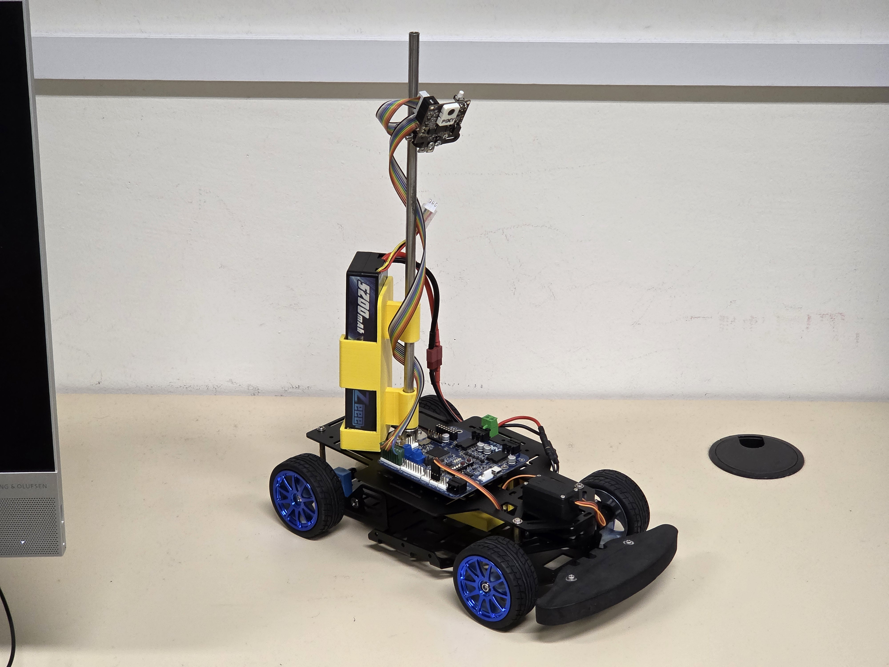
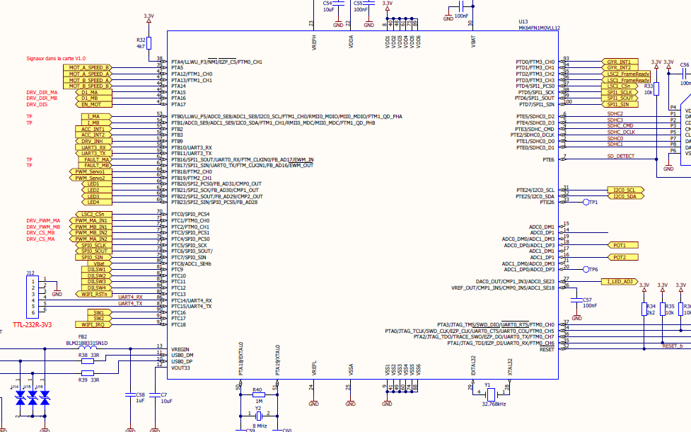

# NXP-Cup-Autonomous-Car-From-A-to-Z 🏎️🤖

Welcome to the ultimate, ground-up guide to building and programming a high-performance autonomous race car for the NXP Cup!

Whether you are a complete beginner holding a microcontroller for the first time, or an intermediate student looking to push your car to its absolute limits, this repository is built for you. We don't just give you the final code; we explain **why** and **how** everything works, from the physics of the hardware to bare-metal C++ programming.

> **💡 The Philosophy of this Course:**
> We believe in learning by understanding the roots. Instead of running into frustrating hardware conflicts or burning out servos and fixing them later, this guide is designed proactively. We will build the system step-by-step, ensuring you understand exactly what every register, pin, and algorithm does before moving forward.

---

## 🛠️ The Hardware Stack

Before we write any code, we need to know our machine. This project utilizes the official NXP Cup hardware ecosystem:

* **The Brains:** NXP Kinetis K64F Microcontroller (MK64FN1M0VLL12) featuring a 120 MHz ARM Cortex-M4 core.
* **The Shield:** RDDRONE-CUPK64 expansion board used to interface with motors and sensors.
* **The Muscle:** Standard NXP Cup chassis, rear DC motors, and an internal **MC33887 H-Bridge** driver to control speed and direction.
* **The Steering:** Recommended standard steering servo for precise directional control.
* **The Power:** 7.4V LiPo Battery providing high current for motors and regulated power for logic.
* **The Eyes:** **Pixy2 Line Scan Camera** communicating via SPI to detect track vectors.
* **The Environment Sensors:** Ultrasonic sensors for obstacle detection, plus the onboard IMU (Accelerometer, Magnetometer, Gyroscope) for inertia and orientation.

---

## 📚 Course Roadmap

This repository is structured as a chronological course. We highly recommend following the modules in order:

### **Module 1: Hardware Deep-Dive & The Physical Build**
Get to know the chassis, the motors, and the silicon. We break down the difference between a physical pin, an electrical signal, and an internal MCU interface (GPIO, SPI, I2C, PWM). Includes schematics and wiring photos!

### **Module 2: The Pin Muxing Architecture (Getting it Right)**
Learn how to configure the K64F's internal multiplexer. We'll dive into bare-metal coding to assign `ALT` modes and fix notorious hardware conflicts—specifically preventing the default FRDM-K64F UART and Ethernet settings from hijacking our motor control pins.

### **Module 3: Low-Level Control (ADC & PWM)**
Time to make things move. We cover:
* **Analog-to-Digital Conversion (ADC):** Reading potentiometers to test input systems.
* **FlexTimer (FTM):** Configuring the timer modules (FTM0 & FTM2) to generate precise PWM signals (20kHz for motors, 50-100Hz for servos).

### **Module 4: Machine Vision & Memory Management (Pixy2)**
Interfacing with the Pixy2 camera via SPI. We tackle C++ memory management, explaining why we use dynamic `std::vector` containers instead of fixed arrays to prevent crashes, and how to filter out visual noise (like sun glare) using Euclidean norm calculations.

### **Module 5: Control Theory (Building the Custom PID)**
From basic line-following to advanced stability. We build a custom PID controller and solve the dreaded "Waddling" (oscillation) problem using an advanced mathematical concept called **Integral Decay**, which naturally bleeds off error accumulation in straightaways.

### **Module 6: F1-Style Racing Algorithms**
Taking the training wheels off. We implement predictive algorithms:
* **Lookahead:** Dissociating the "Head" and "Tail" of a vector for better reaction times.
* **Asymmetry:** Calculating the geometry of the track to predict curves before entering them.
* **Apex Targeting:** Dynamically shifting the track's center point with an artificial offset to cut corners like a real race car.

### **Module 7: Hardware Security & Robustness**
How to make your car bulletproof. We implement a software **"Servo Saver"** incorporating:
* **Deadband:** Ignoring micro-jitters to prevent overheating.
* **Low-Pass Filter:** Soft-starting servo movements to protect gears.
* **Watchdog:** An emergency timeout to cut motor power if the car loses sight of the track.

---

## 🚀 How to Use This Repository

Each module contains detailed `README` explanations, schematic images to trace connections, and the heavily commented C++ code required for that step.

---

# Module 1: Hardware Deep-Dive & MCU Fundamentals 🏎️🧠

Welcome to Module 1! Before we write a single line of C++ code, we need to understand the physical machine we are building. You cannot program a microcontroller effectively if you don't understand how it connects to the physical world.

In this module, we will explore the NXP Cup chassis, the power delivery, the processing brain, and the crucial theory of how microcontrollers communicate with hardware.

---

## 1. The Physical Build: Chassis, Power, and Steering

The NXP Cup car is a standard robotic racing platform. Here is what makes up the physical foundation:

* **The Chassis & Drive:** We use the standard NXP Cup car chassis equipped with rear DC motors to provide propulsion. 
* **The Steering:** Directional control is handled by a standard analog steering servo. Unlike the drive motors which spin continuously, the servo expects a precise signal to hold a specific angle.
* **The Power Source:** The entire system is powered by a **7.4V LiPo (Lithium Polymer) battery**. This battery provides the high current necessary for the motors while also being regulated down to 3.3V/5V to safely power the logic board.

---

## 2. The Brains: Microcontroller & Shield

To control the car, we use a two-board stacked architecture: the MCU (Microcontroller Unit) and the Shield.

### The Microcontroller: NXP Kinetis K64F
At the heart of our system is the **Kinetis K64F** (specific chip: `MK64FN1M0VLL12`). 
* It features an **ARM Cortex-M4** core.
* It runs at a blazing fast **120 MHz**, giving us plenty of processing power to run complex math (like PID controllers and image processing) in real-time.

### The Shield: RDDRONE-CUPK64
We stack the **RDDRONE-CUPK64** expansion board on top of the K64F. This board acts as a bridge between the delicate 3.3V logic of the MCU and the high-power physical world.
* **The H-Bridge (MC33887):** A microcontroller cannot provide enough current to spin a DC motor directly. The shield includes an internal **MC33887 H-bridge driver**. The MCU sends low-power logic signals to the H-bridge, and the H-bridge safely routes the high-current 7.4V battery power to the motors.

> [RDDRONE-CUPK64](https://www.nxp.com/part/RDDRONE-CUPK64)

---

## 3. The Eyes & Ears: Sensors

To drive autonomously, the car needs to see the track and sense its own physics.

### Pixy2 Camera (Vision)
The main sensor is the [Pixy2 Line Scan Camera](https://pixycam.com/pixy2/). We use it to detect the edges of the track. It communicates with our board using the **SPI** (Serial Peripheral Interface) bus, specifically SPI1.

### Ultrasonic Sensors (Obstacle Detection)
To comply with NXP Cup rules, we integrate ultrasonic sensors to detect obstacles on the track, preventing collisions.

### Internal IMU (Inertial Measurement Unit)
The RDDRONE board includes built-in sensors to detect the car's motion:
* **Accelerometer & Magnetometer:** Connected to pins `PTB2` (ACC_INT1) and `PTB3` (ACC_INT2). They communicate data via the I2C0 bus on pins `PTE24` and `PTE25`.
* **Gyroscope:** Connected to pins `PTD0` (GYR_INT1) and `PTD1` (GYR_INT2).

> 📖 **Further Reading:** Check out the official [RDDRONE Design Files]([https://nxp.gitbook.io/nxp-cup/](https://www.nxp.com/design/design-center/development-boards-and-designs/RDDRONE-CUPK64?#design-resources)) for specific hardware constraints and competition rules regarding sensor placement.

Click the image to open the full PDF.

---

## 4. Embedded Systems Theory: Pins vs. Signals vs. Interfaces

Before we write code in the next module, you must understand these three fundamental concepts:

1. **A Pin:** This is the physical metal contact on the microcontroller or electronic component. Its only job is to physically transport an electrical signal (Input or Output).
2. **A Signal:** This is the actual electrical information flowing through the pin. It can be Digital ($0/1$), Analog (variable voltage), or Periodic (like a PWM wave).
3. **An Interface / Bus:** This is the internal hardware module inside the microcontroller that defines *how* we communicate. 

**Crucial Rule:** The Interface is NOT the Pin. An interface is the internal manager, and it can be routed to use one or multiple pins. 

Here are the interfaces we will use in this project:
* **GPIO (General Purpose Input/Output):** The simplest interface. It reads a digital $0$ or $1$ (Input) or outputs a $0$ or $1$ (Output). We use this to enable/disable the motor driver.
* **PWM (Pulse Width Modulation):** Generates a periodic rectangular wave with a variable duty cycle. We use this to control the *speed* of the DC motors and the *angle* of the steering servo.
* **ADC (Analog to Digital Converter):** Converts a varying analog voltage into a digital number.
* **SPI (Serial Peripheral Interface):** A fast, synchronous, 4-wire bus (MOSI, MISO, SCK, CS). We use this to talk to the Pixy2 camera.
* **I2C (Inter-Integrated Circuit):** A 2-wire bus (SDA, SCL). Used for our onboard IMU sensors.

---

## 5. The Software Bridge: What is an SDK?

Before we start writing code, we need to talk about the **SDK (Software Development Kit)**. 

### What is an SDK?
An SDK is a collection of software tools, pre-written libraries, and hardware drivers provided by the manufacturer. Instead of forcing you to write complicated, low-level "bare-metal" code to turn on a single pin by manually changing memory registers (like writing `PORTD->PCR[5] = ...`), an SDK gives you easy-to-read functions (like `PORT_SetPinMux(...)`). It acts as a translator between your C++ logic and the silicon. 

### The Problem: The Missing SDK
Here is the catch: NXP provides an official SDK called MCUXpresso, but **there is no specific SDK built exactly for our RDDRONE-CUPK64 shield**. 

### The Solution: The "FRDM-K64F" Workaround
As recommended by the NXP Cup Gitbook, we use a clever workaround. Because our car's brain is the Kinetis K64F microcontroller (MK64FN1M0), we select the SDK for a different, very popular development board called the **FRDM-K64F**. Since they share the exact same chip, the core software works perfectly!

### The Consequence: Default Configurations
However, using a different board's SDK introduces a massive hidden problem. The FRDM-K64F SDK comes pre-loaded with default pin configurations for *its own* hardware features. For example:
* It automatically configures pins for an Ethernet port.
* It automatically configures pins `PTB16` and `PTB17` for UART0 (Serial communication/Debugging).

**Why is this a problem?** Because on our RDDRONE-CUPK64 car, those exact same pins are physically wired to our motor controller's enable switches and fault status readers! If the SDK secretly configures them for Ethernet or UART, our motors become completely uncontrollable.

---

### ⏭️ Next Step: Taking Back Control
Now that we know our hardware and understand that our SDK is secretly trying to configure pins for a different board, we have to fight back! 

Join us in **[Module 2: The Pin Muxing Architecture]**, where we will dive into bare-metal C programming to delete the FRDM-K64F defaults and manually route the K64F's internal multiplexer to our motors and sensors.

